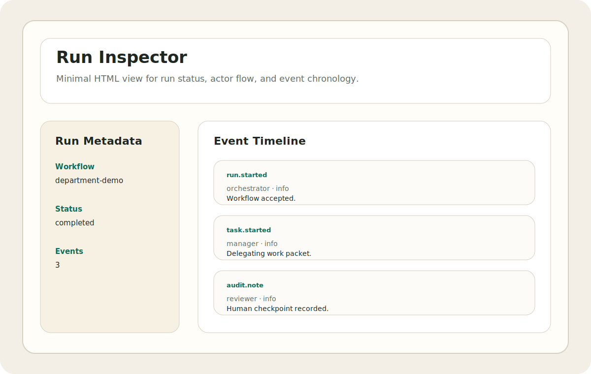

# nano-agent-observability

[](https://github.com/r4ullopezdev/nano-agent-observability/actions/workflows/ci.yml)
[](./LICENSE)

Tracing and logging utilities for auditable multi-agent workflows.



## Why this matters

Multi-agent systems fail quietly when orchestration is opaque. This package focuses on the minimum useful layer for traceability:

- structured logs
- run metadata
- event traces
- markdown and JSON exports
- historical run archive export/import
- audit hooks
- explicit run status handling
- richer HTML run inspector with actor/event breakdowns and metadata panels

## Quickstart

```bash
npm install
npm run demo
npm run inspect
```

The demo writes:

- `artifacts/run.json`
- `artifacts/run.md`
- `artifacts/run-inspector.html`

To combine multiple runs into a simple history file:

```bash
node --import tsx src/cli.ts archive artifacts/run.json artifacts/run.json
```

## Design note

See [docs/design-note-001-observability-scope.md](./docs/design-note-001-observability-scope.md) for the rationale behind keeping observability intentionally small and audit-oriented.
